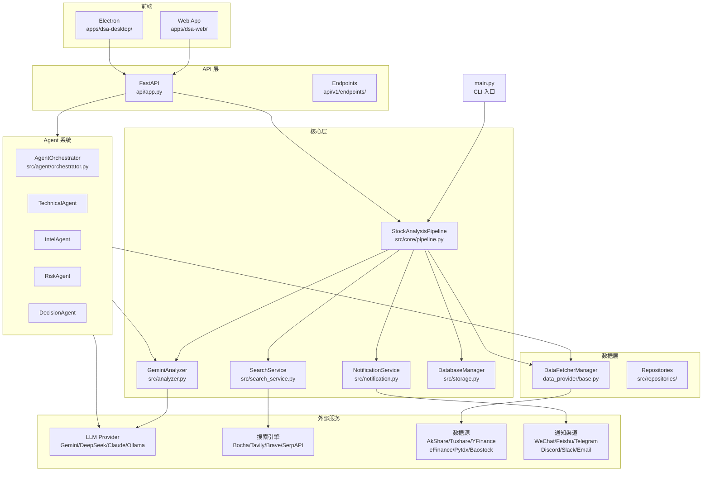
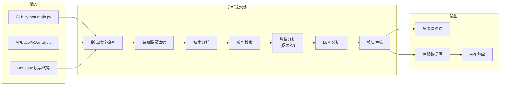
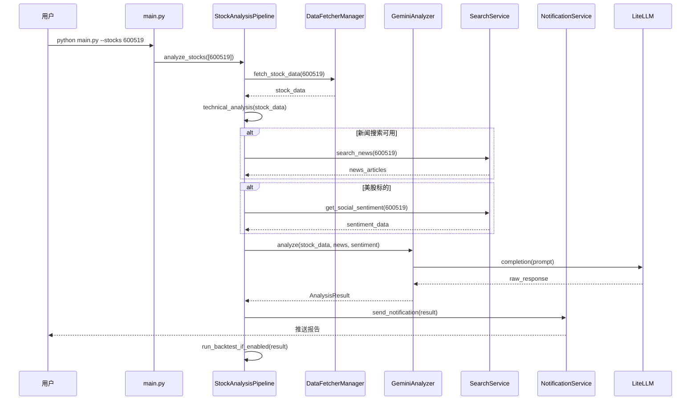
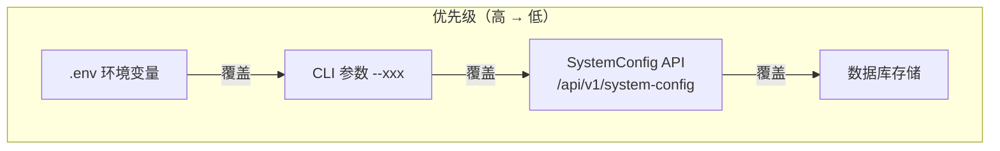
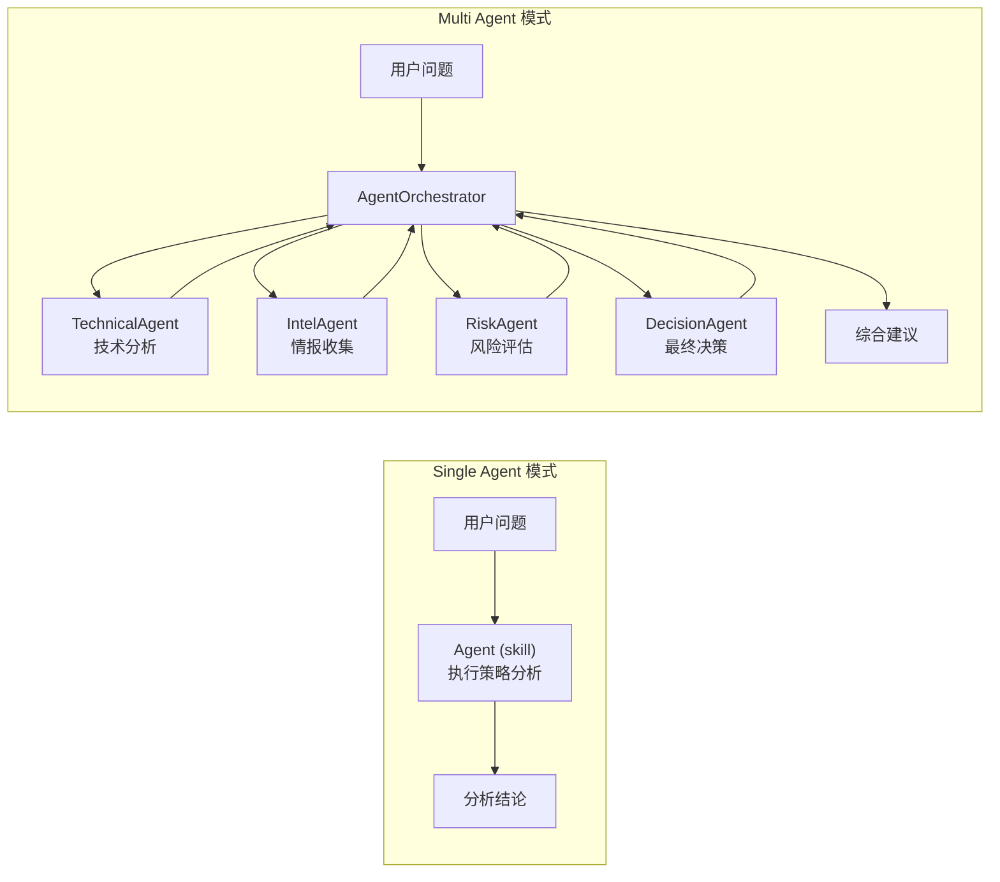

# 系统架构文档

## 概述

Daily Stock Analysis（A股/港股/美股自选股智能分析系统）是一个功能完整的股票智能分析平台，覆盖 A 股、港股、美股三大市场。系统通过抓取多源数据、进行技术分析、搜索最新新闻、调用 LLM 生成智能分析报告，并支持多渠道通知推送。

**核心能力**：
- 多数据源自动 fallback（AkShare、Tushare Pro、东方财富、Yahoo Finance 等）
- 多 AI 模型支持（Gemini、DeepSeek、Claude、GPT 等通过 LiteLLM 统一封装）
- 多通知渠道（企业微信、飞书、Telegram、Discord、Slack、邮件等 12+ 种）
- Agent 策略对话系统（支持自然语言问股和技术分析）
- 自动化回测验证分析准确性
- Web 界面 + Electron 桌面客户端

**技术架构特征**：每秒可处理多只股票并发分析，支持断点续传，单股失败不影响整体流程。

## 技术栈

### 后端语言与框架

| 类别 | 技术 |
|------|------|
| **语言** | Python 3.10+ |
| **Web 框架** | FastAPI 0.109+ |
| **ASGI 服务器** | Uvicorn |
| **ORM** | SQLAlchemy 2.0+ |
| **数据库** | SQLite（内置） |
| **模板引擎** | Jinja2 |

### 前端技术

| 类别 | 技术 |
|------|------|
| **框架** | React 19 |
| **构建工具** | Vite 7 |
| **语言** | TypeScript |
| **UI 框架** | Tailwind CSS 4 |
| **状态管理** | Zustand 5 |
| **图表** | Recharts |
| **路由** | React Router DOM 7 |

### 桌面端

| 类别 | 技术 |
|------|------|
| **框架** | Electron 31 |
| **打包** | electron-builder |

### 数据存储

| 类别 | 技术 |
|------|------|
| **主数据库** | SQLite |
| **配置存储** | SQLite + 环境变量 + SystemConfig API |
| **缓存** | 内存缓存（数据获取层） |

### 基础设施

| 类别 | 技术 |
|------|------|
| **CI/CD** | GitHub Actions |
| **容器化** | Docker + Docker Compose |
| **容器注册表** | GHCR (GitHub Container Registry) |

### 外部服务与 API

**AI 模型（通过 LiteLLM）**：

| Provider | 协议 | 配置项 |
|----------|------|--------|
| Gemini | Google AI | `GEMINI_API_KEY` |
| OpenAI | OpenAI | `OPENAI_API_KEY` + `OPENAI_BASE_URL` |
| DeepSeek | OpenAI Compatible | `DEEPSEEK_API_KEY` |
| Anthropic | Anthropic | `ANTHROPIC_API_KEY` |
| Ollama | OpenAI Compatible | `OLLAMA_API_BASE` |
| AIHubMix | OpenAI Compatible | `AIHUBMIX_KEY` |

**行情数据源**：

| 数据源 | 用途 | 优先级 |
|--------|------|--------|
| eFinance | 东方财富数据 | 最高 |
| AkShare | A股/港股行情 | 高 |
| Tushare Pro | A股增强数据 | 中 |
| Pytdx | 通达信数据 | 中 |
| Baostock | 备用数据源 | 低 |
| YFinance | 美股数据 | 最高（美股） |

**搜索引擎**：

| 服务 | 用途 | 配置 |
|------|------|------|
| Bocha | 中文搜索优化 | `BOCHA_API_KEYS` |
| Tavily | 新闻搜索 | `TAVILY_API_KEYS` |
| SerpAPI | 搜索引擎 | `SERPAPI_API_KEYS` |
| Brave | 英文搜索 | `BRAVE_API_KEYS` |
| MiniMax | 结构化搜索 | `MINIMAX_API_KEYS` |
| SearXNG | 自建搜索 | `SEARXNG_BASE_URLS` |

## 项目结构

```
project-root/
├── main.py                    # CLI 主入口（定时/单次分析）
├── server.py                  # FastAPI 服务入口
├── webui.py                   # Web UI 独立启动脚本
├── analyzer_service.py        # 分析服务封装层
├── test_env.py                # 测试环境验证
│
├── src/                       # 核心业务逻辑
│   ├── config.py              # 配置管理（单例模式）
│   ├── analyzer.py            # AI 分析器（GeminiAnalyzer）
│   ├── stock_analyzer.py      # 股票技术分析
│   ├── market_analyzer.py      # 大盘分析
│   ├── notification.py        # 通知服务
│   ├── storage.py             # SQLite 数据库层
│   ├── search_service.py      # 新闻搜索服务
│   ├── scheduler.py           # 定时任务调度
│   ├── auth.py                # 认证模块
│   ├── checkpoint.py          # 断点续传
│   ├── formatters.py          # 格式化工具
│   ├── feishu_doc.py          # 飞书云文档集成
│   ├── report_language.py     # 报告语言处理
│   ├── md2img.py              # Markdown 转图片
│   ├── webui_frontend.py      # 前端资源准备
│   ├── logging_config.py      # 日志配置
│   ├── enums.py               # 枚举类型定义
│   │
│   ├── core/                  # 核心流水线
│   │   ├── pipeline.py        # 分析主流水线（~1500行）
│   │   ├── market_review.py   # 大盘复盘
│   │   ├── trading_calendar.py # 交易日历
│   │   ├── market_strategy.py  # 市场策略
│   │   ├── market_profile.py   # 市场概况
│   │   ├── backtest_engine.py  # 回测引擎
│   │   ├── config_manager.py   # 配置管理
│   │   └── config_registry.py  # 配置注册表
│   │
│   ├── services/              # 业务服务层
│   │   ├── analysis_service.py
│   │   ├── history_service.py
│   │   ├── portfolio_service.py
│   │   ├── backtest_service.py
│   │   ├── task_queue.py
│   │   ├── task_service.py
│   │   ├── system_config_service.py
│   │   ├── portfolio_risk_service.py
│   │   ├── portfolio_import_service.py
│   │   ├── image_stock_extractor.py
│   │   ├── social_sentiment_service.py
│   │   └── report_renderer.py
│   │
│   ├── agent/                 # Agent 策略对话系统
│   │   ├── executor.py
│   │   ├── orchestrator.py
│   │   ├── runner.py
│   │   ├── llm_adapter.py
│   │   ├── factory.py
│   │   ├── memory.py
│   │   ├── conversation.py
│   │   ├── events.py
│   │   ├── research.py
│   │   ├── protocols.py
│   │   ├── agents/
│   │   │   ├── base_agent.py
│   │   │   ├── technical_agent.py
│   │   │   ├── intel_agent.py
│   │   │   ├── risk_agent.py
│   │   │   ├── decision_agent.py
│   │   │   └── portfolio_agent.py
│   │   ├── skills/
│   │   │   ├── base.py
│   │   │   ├── defaults.py
│   │   │   ├── aggregator.py
│   │   │   ├── router.py
│   │   │   └── skill_agent.py
│   │   ├── strategies/
│   │   └── tools/
│   │
│   ├── repositories/          # 数据访问层
│   │   ├── analysis_repo.py
│   │   ├── backtest_repo.py
│   │   ├── portfolio_repo.py
│   │   └── stock_repo.py
│   │
│   ├── schemas/               # 数据结构
│   │   └── report_schema.py
│   │
│   ├── utils/                # 工具函数
│   │   ├── data_processing.py
│   │   └── analysis_metadata.py
│   │
│   ├── quant/                 # 量化模块
│   │   ├── integration.py
│   │   ├── data/
│   │   ├── factors/
│   │   ├── models/
│   │   ├── regime/
│   │   ├── scoring/
│   │   ├── training/
│   │   └── lifecycle/
│   │
│   └── notification_sender/   # 通知发送器
│       ├── email_sender.py
│       ├── wechat_sender.py
│       ├── feishu_sender.py
│       ├── telegram_sender.py
│       ├── discord_sender.py
│       ├── slack_sender.py
│       ├── pushover_sender.py
│       ├── pushplus_sender.py
│       ├── serverchan3_sender.py
│       ├── astrbot_sender.py
│       └── custom_webhook_sender.py
│
├── api/                       # FastAPI REST API
│   ├── app.py                 # FastAPI 应用工厂
│   ├── deps.py                # 依赖注入
│   ├── middlewares/
│   │   ├── auth.py
│   │   └── error_handler.py
│   └── v1/
│       ├── router.py
│       ├── endpoints/
│       │   ├── analysis.py
│       │   ├── history.py
│       │   ├── portfolio.py
│       │   ├── stocks.py
│       │   ├── auth.py
│       │   ├── backtest.py
│       │   ├── agent.py
│       │   ├── system_config.py
│       │   ├── quant.py
│       │   ├── usage.py
│       │   └── health.py
│       └── schemas/
│
├── data_provider/             # 多数据源适配
│   ├── base.py                # 基类与公共接口
│   ├── akshare_fetcher.py
│   ├── tushare_fetcher.py
│   ├── yfinance_fetcher.py
│   ├── efinance_fetcher.py
│   ├── pytdx_fetcher.py
│   ├── baostock_fetcher.py
│   ├── tickflow_fetcher.py
│   ├── us_index_mapping.py
│   ├── fundamental_adapter.py
│   └── realtime_types.py
│
├── bot/                       # 机器人平台集成
│   ├── dispatcher.py
│   ├── handler.py
│   ├── models.py
│   ├── commands/
│   │   ├── analyze.py
│   │   ├── ask.py
│   │   ├── chat.py
│   │   ├── batch.py
│   │   ├── history.py
│   │   ├── market.py
│   │   ├── research.py
│   │   ├── status.py
│   │   ├── strategies.py
│   │   └── help.py
│   └── platforms/
│       ├── dingtalk.py
│       ├── dingtalk_stream.py
│       ├── feishu_stream.py
│       └── discord.py
│
├── apps/
│   ├── dsa-web/              # Web 前端
│   │   ├── src/
│   │   │   ├── main.tsx
│   │   │   ├── App.tsx
│   │   │   ├── api/
│   │   │   ├── components/
│   │   │   ├── pages/
│   │   │   ├── stores/
│   │   │   ├── hooks/
│   │   │   ├── contexts/
│   │   │   ├── types/
│   │   │   └── utils/
│   │   └── tests/
│   │
│   └── dsa-desktop/          # Electron 桌面端
│       ├── main.js
│       ├── preload.js
│       └── renderer/
│
├── strategies/                # 内置交易策略 YAML
│   ├── bull_trend.yaml
│   ├── ma_golden_cross.yaml
│   ├── volume_breakout.yaml
│   ├── shrink_pullback.yaml
│   ├── bottom_volume.yaml
│   ├── dragon_head.yaml
│   ├── one_yang_three_yin.yaml
│   ├── box_oscillation.yaml
│   ├── chan_theory.yaml
│   ├── wave_theory.yaml
│   └── emotion_cycle.yaml
│
├── templates/                 # Jinja2 报告模板
│   ├── report_markdown.j2
│   ├── report_brief.j2
│   ├── report_wechat.j2
│   └── _macros.j2
│
├── scripts/                   # 本地脚本
│   ├── ci_gate.sh
│   ├── check_ai_assets.py
│   ├── build-all.ps1
│   └── ...
│
├── tests/                     # pytest 测试套件
├── .github/
│   └── workflows/
│       ├── ci.yml
│       ├── daily_analysis.yml
│       ├── desktop-release.yml
│       ├── docker-publish.yml
│       └── pr-review.yml
│
├── docker/
│   ├── Dockerfile
│   └── docker-compose.yml
│
└── docs/
```

**入口点**：

- `main.py` - CLI 主入口，支持定时任务、单次分析、大盘复盘等模式
- `server.py` - FastAPI 服务入口，用于 `uvicorn server:app --reload`
- `webui.py` - Web UI 独立启动脚本
- `analyzer_service.py` - 分析服务封装，提供 `analyze_stock()` 和 `analyze_stocks()` 接口

## 子系统

### StockAnalysisPipeline（分析主流水线）

**目的**：协调数据获取、技术分析、AI 分析、新闻搜索、通知推送的完整分析流程

**位置**：`src/core/pipeline.py`

**关键组件**：
- `DataFetcherManager` - 多数据源管理，支持自动 fallback
- `StockTrendAnalyzer` - 技术分析引擎
- `GeminiAnalyzer` - LLM 分析
- `SearchService` - 新闻搜索
- `SocialSentimentService` - 社交舆情（仅美股）
- `NotificationService` - 多渠道通知

**依赖**：数据源服务、AI 模型服务、搜索引擎

**被依赖**：CLI 入口、Web API、Bot 命令

---

### GeminiAnalyzer（AI 分析层）

**目的**：通过 LiteLLM 统一调用各类 LLM，生成结构化分析报告

**位置**：`src/analyzer.py`

**关键文件**：`GeminiAnalyzer` 类（~2000行），负责：
- 构建 Prompt（技术面 + 消息面 + 舆情）
- 调用 LLM API
- 解析 JSON 响应为 `AnalysisResult`
- 多模型 fallback（Gemini → Claude → GPT → Ollama）

**依赖**：LiteLLM、LLM API

**被依赖**：`StockAnalysisPipeline`

---

### DataFetcherManager（多数据源适配）

**目的**：统一数据获取接口，失败自动降级

**位置**：`data_provider/base.py`

**关键数据源**：
- `eFinanceFetcher` - 东方财富（最高优先级）
- `AkShareFetcher` - AkShare
- `TushareFetcher` - Tushare Pro
- `YFinanceFetcher` - Yahoo Finance（美股）
- `PytdxFetcher` - 通达信
- `BaostockFetcher` - Baostock

**依赖**：各数据源 API

**被依赖**：`StockAnalysisPipeline`、API 端点

---

### NotificationService（通知服务）

**目的**：汇总分析结果生成 Markdown 报告，发送到多渠道

**位置**：`src/notification.py` + `src/notification_sender/`

**支持渠道**：
- 企业微信 Webhook
- 飞书 Webhook/Stream
- Telegram Bot
- Discord Webhook/Bot
- Slack Webhook/Bot
- Email (SMTP)
- PushPlus
- Server酱3
- Pushover
- AstrBot
- 自定义 Webhook

**依赖**：各渠道 API

**被依赖**：`StockAnalysisPipeline`

---

### Agent 策略对话系统

**目的**：支持自然语言问股和多策略技术分析

**位置**：`src/agent/`

**多 Agent 架构**：
- `TechnicalAgent` - 技术分析
- `IntelAgent` - 情报收集
- `RiskAgent` - 风险评估
- `DecisionAgent` - 最终决策
- `PortfolioAgent` - 持仓分析

**编排模式**：`single` / `multi`（可配置）

**工具系统**：`analysis_tools`、`data_tools`、`backtest_tools`、`search_tools`、`market_tools`

**依赖**：LLM 服务、搜索服务、数据服务

**被依赖**：API 端点 `/api/v1/agent`

---

### FastAPI REST API

**目的**：提供 HTTP API 接口，支持 Web UI 和外部集成

**位置**：`api/`

**主要端点**：
- `/api/v1/analysis` - 股票分析
- `/api/v1/history` - 历史记录
- `/api/v1/portfolio` - 持仓管理
- `/api/v1/stocks` - 股票数据
- `/api/v1/backtest` - 回测
- `/api/v1/agent` - Agent 对话
- `/api/v1/system-config` - 系统配置
- `/api/v1/health` - 健康检查

**依赖**：各业务服务

---

### Web 前端（dsa-web）

**目的**：提供浏览器端管理界面

**位置**：`apps/dsa-web/`

**技术栈**：React 19 + Vite 7 + TypeScript + Tailwind CSS 4 + Zustand

**主要页面**：
- `HomePage` - 首页概览
- `ChatPage` - Agent 对话
- `BacktestPage` - 回测
- `PortfolioPage` - 持仓管理
- `SettingsPage` - 系统设置

---

### Electron 桌面端（dsa-desktop）

**目的**：提供跨平台桌面客户端

**位置**：`apps/dsa-desktop/`

**打包目标**：Windows (NSIS) + macOS (DMG, x64/arm64)

---

## 系统架构图



## 数据流程图



## 分析流程时序图



## 配置层级



## Agent 多 Agent 编排模式


