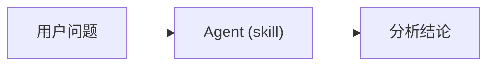
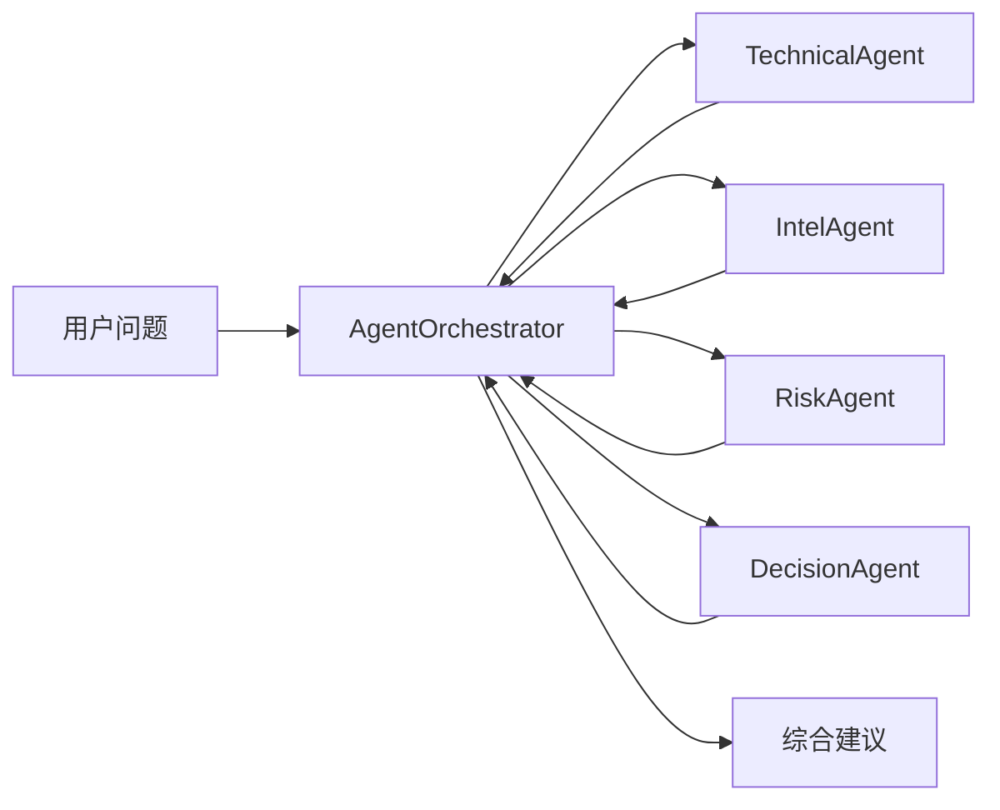

# Agent 系统

多 Agent 编排策略，支持自然语言问股和技术分析。

## 什么是 Agent 系统？

`AgentOrchestrator` 管理和编排多个专业 Agent，通过协作生成综合分析建议。

**关键特征**：
- 多 Agent 协作（Technical/Intel/Risk/Decision）
- Single 和 Multi 两种模式
- 策略路由（自动/手动）
- 工具系统扩展

## 代码位置

| 方面 | 位置 |
|------|------|
| 编排器 | `src/agent/orchestrator.py` |
| Agent | `src/agent/agents/` |
| 技能 | `src/agent/skills/` |
| 工具 | `src/agent/tools/` |
| 测试 | `tests/test_agent_*.py` |

## Agent 类型

| Agent | 职责 | 输入 |
|--------|------|------|
| `TechnicalAgent` | 技术分析（均线/KDJ/MACD） | 股票数据 |
| `IntelAgent` | 情报收集（新闻/公告） | 搜索结果 |
| `RiskAgent` | 风险评估 | 市场环境 |
| `DecisionAgent` | 最终决策 | 综合信息 |

## 编排模式

### Single Agent 模式

### Multi Agent 模式

## 策略路由

策略路由决定使用哪些技能分析：

| 模式 | 说明 |
|------|------|
| `auto` | 根据市场状态自动选择 |
| `manual` | 使用 `AGENT_SKILLS` 列表 |

### 内置策略

| 策略 | 说明 |
|------|------|
| `bull_trend` | 多头趋势（MA5>MA10>MA20） |
| `ma_golden_cross` | 均线金叉 |
| `volume_breakout` | 放量突破 |
| `shrink_pullback` | 缩量回踩 |
| `bottom_volume` | 底部放量 |
| `dragon_head` | 龙头策略 |
| `box_oscillation` | 箱体震荡 |

## 工具系统

Agent 可以使用工具来获取信息：

| 工具 | 用途 |
|------|------|
| `analysis_tools` | 技术分析计算 |
| `data_tools` | 获取股票数据 |
| `search_tools` | 新闻搜索 |
| `backtest_tools` | 回测查询 |
| `market_tools` | 大盘信息 |
