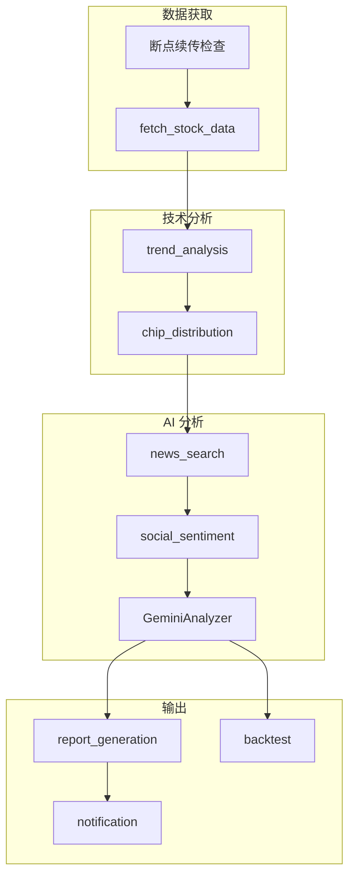

# 分析流水线

股票分析的核心编排引擎，协调各模块完成完整的分析流程。

## 什么是分析流水线？

`StockAnalysisPipeline` 是系统的核心调度器，负责协调数据获取、技术分析、新闻搜索、AI 分析和通知推送的完整流程。

**关键特征**：
- 线程池并发控制
- 断点续传（失败重试）
- 单股失败不影响整体
- 多数据源自动 fallback

## 代码位置

| 方面 | 位置 |
|------|------|
| 核心类 | `src/core/pipeline.py` |
| 相关模块 | `src/stock_analyzer.py`, `src/analyzer.py` |
| 测试 | `tests/test_pipeline_*.py` |

## 流程结构



## 关键方法

### analyze_stocks()

```python
def analyze_stocks(
    self,
    stock_codes: List[str],
    force_refresh: bool = False,
    report_type: str = "simple",
) -> List[AnalysisResult]:
    """
    分析多只股票
    
    Args:
        stock_codes: 股票代码列表
        force_refresh: 是否强制刷新数据
        report_type: 报告类型
        
    Returns:
        AnalysisResult 列表
    """
```

### fetch_and_save_stock_data()

```python
def fetch_and_save_stock_data(
    self,
    code: str,
    force_refresh: bool = False
) -> Tuple[bool, Optional[str]]:
    """
    获取并保存单只股票数据
    
    断点续传逻辑：
    1. 检查数据库是否已有今日数据
    2. 如果有且不强制刷新，则跳过网络请求
    3. 否则从数据源获取并保存
    """
```

## 并发控制

```python
# 配置最大并发数
self.max_workers = max_workers or self.config.max_workers

# 使用 ThreadPoolExecutor 并发处理
with ThreadPoolExecutor(max_workers=self.max_workers) as executor:
    futures = {
        executor.submit(self._analyze_single, code): code
        for code in stock_codes
    }
    for future in as_completed(futures):
        # 收集结果，忽略单股失败
```

## 错误处理

```python
try:
    result = self._analyze_single(code)
except Exception as e:
    logger.error(f"分析股票 {code} 失败: {e}")
    # 单股失败不影响整体，继续处理其他股票
    continue
```

## 配置

| 配置项 | 说明 | 默认值 |
|--------|------|--------|
| `max_workers` | 最大并发线程数 | `4` |
| `enable_realtime_quote` | 是否启用实时行情 | `false` |
| `enable_chip_distribution` | 是否启用筹码分布 | `false` |
| `news_max_age_days` | 新闻最大时效（天） | `3` |
