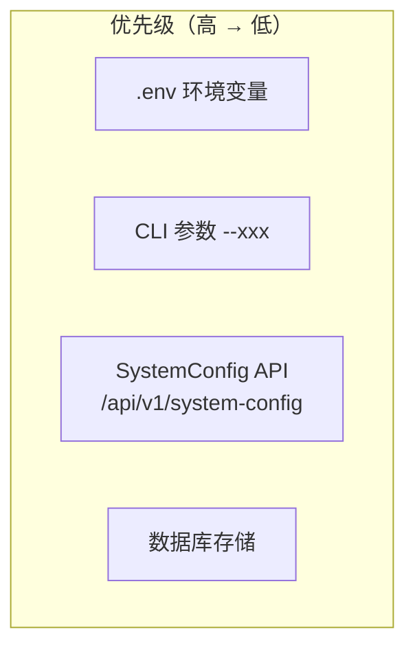

# 配置管理

环境变量与运行时配置的统一管理。

## 什么是配置管理？

`Config` 是全局配置单例，管理所有环境变量和运行时配置。

**关键特征**：
- 单例模式
- 环境变量优先
- 类型安全
- 支持动态更新

## 代码位置

| 方面 | 位置 |
|------|------|
| 核心类 | `src/config.py` |
| 注册表 | `src/core/config_registry.py` |
| 管理器 | `src/core/config_manager.py` |
| API | `api/v1/endpoints/system_config.py` |

## 配置层级



## 主要配置项

### AI 模型配置

| 变量 | 描述 |
|------|------|
| `GEMINI_API_KEY` | Gemini API Key |
| `DEEPSEEK_API_KEY` | DeepSeek API Key |
| `ANTHROPIC_API_KEY` | Anthropic API Key |
| `OPENAI_API_KEY` | OpenAI API Key |
| `LLM_TEMPERATURE` | 采样温度 (0.0-2.0) |

### 数据源配置

| 变量 | 描述 |
|------|------|
| `TUSHARE_TOKEN` | Tushare Pro Token |
| `TICKFLOW_API_KEY` | TickFlow API Key |

### 搜索配置

| 变量 | 描述 |
|------|------|
| `TAVILY_API_KEYS` | Tavily API Keys |
| `BOCHA_API_KEYS` | Bocha API Keys |
| `MINIMAX_API_KEYS` | MiniMax API Keys |

### 通知配置

详见 [通知服务](./通知服务.md)。

## 使用配置

```python
from src.config import get_config, Config

# 获取全局配置
config = get_config()

# 访问配置项
api_key = config.gemini_api_key
max_workers = config.max_workers

# 使用配置创建服务
analyzer = GeminiAnalyzer(config=config)
```

## 动态更新

支持通过 API 动态更新配置：

```bash
# 获取配置
GET /api/v1/system/config

# 更新配置
PUT /api/v1/system/config
{
  "max_workers": 8,
  "report_type": "full"
}
```
